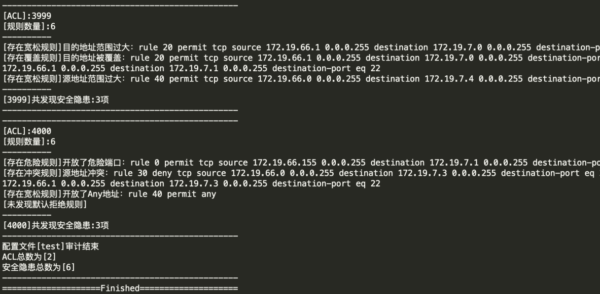

# aclAuditor
批量审计网络设备配置，发现ACL列表中存在安全隐患的规则

#使用方法 
使用前配置以下变量：    
1.dport为需要审计的端口，如21、3389、3306等定义为危险端口   
2.path为配置文件所在目录，支持直接审计完整的设备配置文件，无需单独提取ACL           
3.output为审计日志输出目录，输出文件名为“输入文件名.txt”         
配置后直接运行脚本   

#注意事项      
审计规则基于华三设备的acl格式编写，其他品牌设备的acl格式未进行测试  
格式示例：  
rule 10 deny tcp source 172.19.8.0 0.0.0.255 destination 172.19.7.0 0.0.0.255 destination-port eq 22     

#执行截图
- 